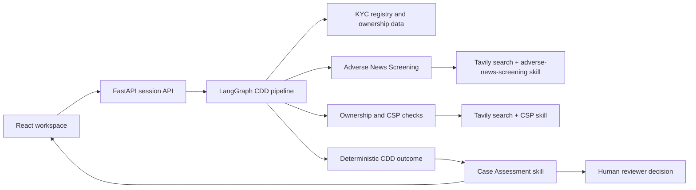

# AML Case Assessment Workspace

An evidence-first workspace for corporate customer due diligence (CDD). It brings
registry data, ownership structure, identity-verification requirements, and
company-service-provider (CSP) address indicators into one
reviewable case. A structured AI review turns the completed evidence packet into
a **Case Assessment** brief; it does not make the compliance decision.

## Why this exists

CDD reviewers often have to reconcile ownership records, registered-address
evidence, and missing documents across separate systems.
AML Case Assessment Workspace makes that work easier to audit: every generated review
is grounded in the retained CDD object, risk flags, and collected evidence.

## Features

- **Full CDD pipeline:** creates or reuses a KYC case and collects the company
  profile, members, ownership chart, and ID&V requirements.
- **Evidence-first risk flags:** checks for ownership gaps and CSP-address
  indicators.
- **CSP Detection:** searches the registered address with Tavily and applies the
  reusable [`csp-detector` skill](skills/csp-detector/SKILL.md) through a strict
  structured assessment.
- **Case Assessment:** uses the reusable [`case-assessment` skill](skills/case-assessment/SKILL.md)
  to synthesize evidence, limitations, internal actions, and draft customer
  Requests for Information (RFIs).
- **Human controls:** a reviewer records **Approve**, **Request information**, or
  **Escalate** with an optional note. The model cannot override the deterministic
  CDD outcome or clear an open risk flag.
- **Reviewable output:** source references, PDF generation, and structured CDD
  JSON are available in the workspace.

## Architecture



### CDD and Case Assessment flow

```text
Company + jurisdiction
  → registry profile, ownership, members, and documents
  → Adverse News Screening after final ID&V extraction
  → ownership / CSP risk flags with retained evidence
  → deterministic outcome: ready to complete or human review required
  → Case Assessment skill
  → evidence summary, limitations, analyst actions, and draft RFIs
  → human reviewer records a decision
```

## CDD state data hierarchy

The LangGraph pipeline carries one shared `CDDState` object. `findings` is the
new neutral, evidence-referenced collection used by Adverse News Screening;
`risk_flags` remains the legacy deterministic-check record and powers the current
`case_status` UI/API summary. `case_assessment_summary` adds reviewer support
without changing the underlying evaluation or severity.

```text
CDDState
├─ metadata                          Customer inputs and KYC case identity
│  ├─ customer
│  │  ├─ name
│  │  ├─ jurisdiction
│  │  └─ registration_number
│  └─ kyc_case
│     ├─ case_id
│     ├─ status_id, status, ready
│     └─ selected_registry_match
│
├─ cdd                               Assembled due-diligence record
│  ├─ started_at / completed_at
│  ├─ company_business_profile
│  │  └─ customer_static: company identity, status, activity, capital,
│  │     registration dates, jurisdiction, registered address, and source
│  ├─ ownership_and_control
│  │  ├─ ubos, shareholders_over_10_percent, related_parties
│  │  ├─ members: controlling members, shareholders, beneficial owners
│  │  └─ org_chart
│  ├─ individual_identity_verification
│  │  └─ policy and required_individuals
│  └─ documents
│
├─ documents                         Append-only document references
│  └─ each: name, category, URL/path, source, collected_at
│
├─ evidence                          Append-only audit trail of gathered material
│  └─ each: source, tool, description, relevance_tags, data, collected_at
│
├─ risk_flags                        Detailed deterministic findings
│  ├─ ownership                       Ownership completeness and UBO identification
│  ├─ csp_address                     Company-service-provider address indicators
│  └─ each finding
│     ├─ finding_id                   Stable category/subject identifier
│     ├─ category                     ownership | csp_address
│     ├─ evaluation                   yes | no | inconclusive
│     ├─ severity                     none | low | medium | high
│     ├─ description, source, subject, evidence
│     └─ case_review (optional)       Confidence, potential impact, action/RFI
│
├─ case_status                       Compact UI/API projection of risk_flags
│  ├─ cdd_generation                 not_started | in_progress | completed |
│  │                                 incomplete | failed
│  └─ risk_summary
│     ├─ by_category
│     │  └─ ownership / csp_address: yes, no, inconclusive counts
│     └─ totals                       Yes, no, inconclusive across all categories
│
├─ case_assessment_summary               Reviewer decision-support brief
│  ├─ status, executive_summary, key_evidence, limitations
│  ├─ recommended_actions
│  ├─ requests_for_information        Request, reason, linked risk/gap, priority
│  ├─ finding_assessments             One confidence assessment per risk finding
│  └─ evidence_index                  Evidence IDs and available source URLs
│
├─ document_requirements             ID&V/document workflow items
│  └─ required person/entity, document type, status, available/uploaded reference
│
└─ messages                          Accumulated LangGraph user/assistant/tool messages
```

## Quick start

### Prerequisites

- Python 3.11+
- Credentials for the KYC sandbox/API
- An OpenAI API key
- A Tavily API key for CSP-address assessment

### Install

```bash
git clone https://github.com/2gauravc/aml-cowork2.git
cd aml-cowork2
python -m pip install -r requirements.lock
```

### Enable Codex

#### Install Codex

```bash
npm install -g @openai/codex
```

#### Log in to Codex

Start Codex and sign in with ChatGPT when prompted:

```bash
codex
```

> **Note:** When accessing the app from a Cloud VM, replace `localhost`
> in the app URL with the machine's IP address.

#### Install supporting tools

```bash
sudo apt update
sudo apt install -y ripgrep
sudo apt install -y bubblewrap
npm install -g playwright
```

### Run Demo Mode

Copy the example configuration and leave `DEMO_MODE=true`. No KYC, S3, Tavily,
or OpenAI credentials are needed.

```bash
cp .env.example .env
python -m uvicorn src.backend.app:app --host 0.0.0.0 --port 8000
```

Open [http://localhost:8000](http://localhost:8000) and select **Load Demo
Case**. The fixture populates the normal CDD, Documents, CSP evidence, and Case
Assessment screens without any external request. Its Case Assessment is deliberately
pre-generated demo content; use Live Mode to run the AI workflows against live
evidence.

### Run Live Mode

Set `DEMO_MODE=false` in `.env`, then add the required credentials. Do not
commit `.env`.

```dotenv
KYCBASEURL=https://api.knowyourcustomer.dev
KYCCLIENTID=your_client_id
KYCCLIENTSECRET=your_client_secret
OPENAI_API_KEY=your_openai_api_key
TAVILY_API_KEY=tvly-your_tavily_key
BRAVE_API_KEY=your_brave_api_key

# All OpenAI workflows default to GPT-5.6. These are optional overrides.
OPENAI_MODEL=gpt-5.6
OPENAI_CSP_MODEL=gpt-5.6
OPENAI_CASE_REVIEW_MODEL=gpt-5.6
OPENAI_DOCUMENT_MODEL=gpt-5.6
OPENAI_POLICY_MODEL=gpt-5.6
OPENAI_ADVERSE_NEWS_MODEL=gpt-5.6
OPENAI_DIGITAL_FOOTPRINT_MODEL=gpt-5.6
OPENAI_OTHER_RISK_FACTORS_MODEL=gpt-5.6
OPENAI_SHELL_COMPANY_RISK_MODEL=gpt-5.6
OPENAI_RISK_RATING_MODEL=gpt-5.6
```

Optional S3 document storage uses boto3's standard credential chain. Use an
EC2 instance role in AWS, or an AWS profile/environment locally; do not commit
long-lived AWS access keys. Set `S3_DOCUMENT_BUCKET_URL`,
`S3_DOCUMENT_BUCKET`, or `AWS_S3_BUCKET_URL` to override the default document
bucket configuration.

The KYC API cache is local by default at `outputs/cache/kyc_api_cache.json`.
Set `KYC_CACHE_S3_BUCKET=onbo-bkt` and `KYC_CACHE_S3_PREFIX=kyc-cache` to make
it persistent. Each company/jurisdiction is stored independently at a path
such as `kyc-cache/SG/sc-engineering-private-limited.json`; the app retains a
local fallback if S3 is unavailable. To copy an existing local cache without
deleting it, first review the migration and then run it:

```bash
python -m src.utils.kyc_cache migrate-local-to-s3 \
  --source outputs/cache/kyc_api_cache.json \
  --bucket onbo-bkt \
  --prefix kyc-cache \
  --region us-east-1 \
  --dry-run

python -m src.utils.kyc_cache migrate-local-to-s3 \
  --source outputs/cache/kyc_api_cache.json \
  --bucket onbo-bkt \
  --prefix kyc-cache \
  --region us-east-1
```

### Start the web app

```bash
python -m uvicorn src.backend.app:app --host 0.0.0.0 --port 8000
```

Open [http://localhost:8000](http://localhost:8000), enter a company and
jurisdiction, then select **Run Full CDD Pipeline**.

### Deploy the EC2 HTTP demo

The EC2 deployment is intentionally a temporary HTTP demo, served at a stable
Elastic IP. It has no DNS name or TLS certificate, so do not use it with
production or sensitive customer traffic.

1. Create one Secrets Manager JSON secret from
   [`infrastructure/ec2/secrets.example.json`](infrastructure/ec2/secrets.example.json).
   Replace every placeholder and retain the secret ARN. The secret contains
   `KYCCLIENTID`, `KYCCLIENTSECRET`, `OPENAI_API_KEY`, `TAVILY_API_KEY`, and
   `BRAVE_API_KEY`.
   Do not add `AWS_ACCESS_KEY_ID`, `AWS_SECRET_ACCESS_KEY`, or
   `AWS_SESSION_TOKEN`; the EC2 instance role supplies temporary AWS credentials.
2. Ensure the deployer has permission to create the CloudFormation, EC2, IAM,
   and networking resources, then run:

   ```bash
   ./infrastructure/ec2/deploy.sh \
     --region us-east-1 \
     --secret-arn arn:aws:secretsmanager:us-east-1:821052193763:secret:demo/amlcowork-1YdyCI
   ```

   `KYCBASEURL` and OpenAI model selections remain normal versioned
   configuration in `.env.example`; the application derives its KYC token
   endpoint from `KYCBASEURL`. The deployment enables the persistent KYC cache
   in `onbo-bkt/kyc-cache/` by default. Use `--s3-bucket`, `--s3-prefix`,
   `--kyc-cache-bucket`, `--kyc-cache-prefix`, or `--secret-kms-key-arn` when
   those defaults do not apply. The script validates the template and secret
   metadata, deploys the stack, waits for the application health check, and
   prints the HTTP Elastic-IP URL and a Session Manager command.

The stack creates a least-privilege EC2 instance profile: scoped document and
KYC-cache S3 access, read access to only the specified application secret, and
Systems Manager access. Bootstrap reads the secret with that role and writes a
root-owned runtime `.env`; it never needs static AWS credentials.

### Demo workflow

1. Run a full CDD case from the **CDD** tab.
2. Review the company profile, ownership structure, ID&V requirements, and risk
   flags.
3. Open **Case Assessment** to see the evidence synthesis and draft RFIs.
4. Use **Refresh summary** after evidence changes.
5. Record the reviewer decision and optional note.

For an isolated CSP check, use the **CSP Detection** tab or run:

```bash
python -m src.tools.csp_detector \
  --address "1 Example Street, London" \
  --company-name "Example Ltd"
```

## AI-assisted workflows

The application uses structured AI in core product workflows:

- **Document extraction:** converts supported PDFs into strict JSON schemas.
- **ID&V policy interpretation:** turns policy text into structured document
  requirements.
- **CSP assessment:** evaluates compact, cited web-search evidence using the
  [`csp-detector` skill](skills/csp-detector/SKILL.md).
- **Adverse News Screening:** screens the company, directors, and UBOs after
  ID&V extraction using the [`adverse-news-screening` skill](skills/adverse-news-screening/SKILL.md),
  retaining web evidence and emitting validated neutral findings.
- **Case Assessment:** loads the [`case-assessment` skill](skills/case-assessment/SKILL.md)
  and produces a strict JSON reviewer brief from the completed CDD object,
  retained risk flags, and tagged evidence.

All structured workflows use strict JSON schemas. The default model is
configurable through `OPENAI_MODEL` and the feature-specific environment
variables. Case Assessment receives the deterministic outcome as non-editable
context; it explains and prioritizes the case but cannot approve, reject,
escalate, or clear risk flags.

## Responsible AI and limitations

- This software is decision support, not an automated compliance decision.
- A CSP indicator is a review item, not proof of wrongdoing.
- Search results and registry data may be incomplete, stale, unavailable, or
  contradictory. The Case Assessment tab surfaces these limitations explicitly.
- RFIs are drafts for a reviewer; the app does not contact customers.
- Reviewers must verify source material, follow their organisation's policy, and
  protect personal data when operating the system.

## Testing

Run the complete test suite:

```bash
python -m unittest discover -s tests -p 'test_*.py'
```

The tests cover CDD graph behavior, CSP assessment, Case Assessment structured
output and guardrails, document processing, and pipeline progress.

### Verify a clean Demo Mode install

From a new clone, install the pinned dependencies, copy the example environment,
and start the server. This path requires no live credentials:

```bash
python -m pip install -r requirements.lock
cp .env.example .env
python -m uvicorn src.backend.app:app --port 8000
```

Open the local app and select **Load Demo Case**. The CDD, Documents, CSP, and
Case Assessment tabs should populate without sending an external request.

## Troubleshooting

| Problem | What to check |
| --- | --- |
| The app starts but the demo button is absent | Copy `.env.example` to `.env` and set `DEMO_MODE=true`, then restart the server. |
| A live workflow reports missing credentials | Set `DEMO_MODE=false` and provide the required KYC, OpenAI, Tavily, and Brave variables. S3 credentials are optional. |
| A document action needs S3 credentials | Use Demo Mode for fixture data, or configure an AWS profile locally / an EC2 instance role in AWS. |
| EC2 deployment finishes but the app is unavailable | Use the printed Session Manager command and inspect `/var/log/aml-cowork2-bootstrap.log`, then run `docker compose ps` in `/opt/aml-cowork2`. |
| An OpenAI request fails after a model change | Confirm the configured model is available to the account and restart the server after changing `.env`. |
| Dependencies fail to install | Use Python 3.11+ and install the pinned set with `python -m pip install -r requirements.lock`. |

## Project layout

```text
src/backend/       FastAPI routes and session handling
src/agents/        LangGraph CDD pipeline and chat workflow
src/tools/         KYC, Tavily, OpenAI, document, and assessment integrations
src/frontend/      React workspace served by FastAPI
skills/            Reusable CSP and Case Assessment instructions
tests/             Unit and workflow tests
```
