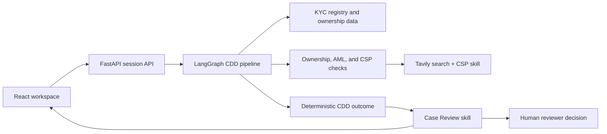

# AML Case Review Workspace

An evidence-first workspace for corporate customer due diligence (CDD). It brings
registry data, ownership structure, identity-verification requirements, AML
signals, and company-service-provider (CSP) address indicators into one
reviewable case. A structured AI review turns the completed evidence packet into
a **Case Review** brief; it does not make the compliance decision.

## Why this exists

CDD reviewers often have to reconcile ownership records, adverse AML signals,
registered-address evidence, and missing documents across separate systems.
AML Case Review Workspace makes that work easier to audit: every generated review
is grounded in the retained CDD object, risk flags, and collected evidence.

## Features

- **Full CDD pipeline:** creates or reuses a KYC case and collects the company
  profile, members, ownership chart, and ID&V requirements.
- **Evidence-first risk flags:** checks for ownership gaps, AML-positive
  controlling members, and CSP-address indicators.
- **CSP Detection:** searches the registered address with Tavily and applies the
  reusable [`csp-detector` skill](skills/csp-detector/SKILL.md) through a strict
  structured assessment.
- **Case Review:** uses the reusable [`case-review` skill](skills/case-review/SKILL.md)
  to synthesize evidence, limitations, internal actions, and draft customer
  Requests for Information (RFIs).
- **Human controls:** a reviewer records **Approve**, **Request information**, or
  **Escalate** with an optional note. The model cannot override the deterministic
  CDD outcome or clear an open risk flag.
- **Reviewable output:** source references, PDF generation, and structured CDD
  JSON are available in the workspace.

## Architecture



### CDD and Case Review flow

```text
Company + jurisdiction
  → registry profile, ownership, members, and documents
  → ownership / AML / CSP risk flags with retained evidence
  → deterministic outcome: ready to complete or human review required
  → Case Review skill
  → evidence summary, limitations, analyst actions, and draft RFIs
  → human reviewer records a decision
```

## Quick start

### Prerequisites

- Python 3.11+
- Credentials for the KYC sandbox/API
- An OpenAI API key
- A Tavily API key for CSP-address assessment

### Install

```bash
git clone https://github.com/2gauravc/aml-cowork2.git
cd aml-cowork2
python -m pip install -r requirements.lock
```

### Run Demo Mode

Copy the example configuration and leave `DEMO_MODE=true`. No KYC, S3, Tavily,
or OpenAI credentials are needed.

```bash
cp .env.example .env
python -m uvicorn src.backend.app:app --host 0.0.0.0 --port 8000
```

Open [http://localhost:8000](http://localhost:8000) and select **Load Demo
Case**. The fixture populates the normal CDD, Documents, CSP evidence, and Case
Review screens without any external request. Its Case Review is deliberately
pre-generated demo content; use Live Mode to run the AI workflows against live
evidence.

### Run Live Mode

Set `DEMO_MODE=false` in `.env`, then add the required credentials. Do not
commit `.env`.

```dotenv
KYCBASEURL=https://api.knowyourcustomer.dev
KYCCLIENTID=your_client_id
KYCCLIENTSECRET=your_client_secret
OPENAI_API_KEY=your_openai_api_key
TAVILY_API_KEY=tvly-your_tavily_key

# All OpenAI workflows default to GPT-5.6. These are optional overrides.
OPENAI_MODEL=gpt-5.6
OPENAI_CSP_MODEL=gpt-5.6
OPENAI_CASE_REVIEW_MODEL=gpt-5.6
OPENAI_DOCUMENT_MODEL=gpt-5.6
OPENAI_POLICY_MODEL=gpt-5.6
```

Optional S3 document storage requires `AWS_ACCESS_KEY_ID` and
`AWS_SECRET_ACCESS_KEY`. Set `S3_DOCUMENT_BUCKET_URL` or
`AWS_S3_BUCKET_URL` to override the default document bucket URL.

### Start the web app

```bash
python -m uvicorn src.backend.app:app --host 0.0.0.0 --port 8000
```

Open [http://localhost:8000](http://localhost:8000), enter a company and
jurisdiction, then select **Run Full CDD Pipeline**.

### Demo workflow

1. Run a full CDD case from the **CDD** tab.
2. Review the company profile, ownership structure, ID&V requirements, and risk
   flags.
3. Open **Case Review** to see the evidence synthesis and draft RFIs.
4. Use **Refresh summary** after evidence changes.
5. Record the reviewer decision and optional note.

For an isolated CSP check, use the **CSP Detection** tab or run:

```bash
python -m src.tools.csp_detector \
  --address "1 Example Street, London" \
  --company-name "Example Ltd"
```

## AI-assisted workflows

The application uses structured AI in core product workflows:

- **Document extraction:** converts supported PDFs into strict JSON schemas.
- **ID&V policy interpretation:** turns policy text into structured document
  requirements.
- **CSP assessment:** evaluates compact, cited web-search evidence using the
  [`csp-detector` skill](skills/csp-detector/SKILL.md).
- **Case Review:** loads the [`case-review` skill](skills/case-review/SKILL.md)
  and produces a strict JSON reviewer brief from the completed CDD object,
  retained risk flags, and tagged evidence.

All structured workflows use strict JSON schemas. The default model is
configurable through `OPENAI_MODEL` and the feature-specific environment
variables. Case Review receives the deterministic outcome as non-editable
context; it explains and prioritizes the case but cannot approve, reject,
escalate, or clear risk flags.

## Responsible AI and limitations

- This software is decision support, not an automated compliance decision.
- A CSP indicator or AML signal is a review item, not proof of wrongdoing.
- Search results and registry data may be incomplete, stale, unavailable, or
  contradictory. The Case Review tab surfaces these limitations explicitly.
- RFIs are drafts for a reviewer; the app does not contact customers.
- Reviewers must verify source material, follow their organisation's policy, and
  protect personal data when operating the system.

## Testing

Run the complete test suite:

```bash
python -m unittest discover -s tests -p 'test_*.py'
```

The tests cover CDD graph behavior, CSP assessment, Case Review structured
output and guardrails, document processing, and pipeline progress.

### Verify a clean Demo Mode install

From a new clone, install the pinned dependencies, copy the example environment,
and start the server. This path requires no live credentials:

```bash
python -m pip install -r requirements.lock
cp .env.example .env
python -m uvicorn src.backend.app:app --port 8000
```

Open the local app and select **Load Demo Case**. The CDD, Documents, CSP, and
Case Review tabs should populate without sending an external request.

## Troubleshooting

| Problem | What to check |
| --- | --- |
| The app starts but the demo button is absent | Copy `.env.example` to `.env` and set `DEMO_MODE=true`, then restart the server. |
| A live workflow reports missing credentials | Set `DEMO_MODE=false` and provide the required KYC, OpenAI, and Tavily variables. S3 credentials are optional. |
| A document action needs S3 credentials | Use Demo Mode for fixture data, or configure AWS credentials only when using live S3 document storage. |
| An OpenAI request fails after a model change | Confirm the configured model is available to the account and restart the server after changing `.env`. |
| Dependencies fail to install | Use Python 3.11+ and install the pinned set with `python -m pip install -r requirements.lock`. |

## Project layout

```text
src/backend/       FastAPI routes and session handling
src/agents/        LangGraph CDD pipeline and chat workflow
src/tools/         KYC, Tavily, OpenAI, document, and assessment integrations
src/frontend/      React workspace served by FastAPI
skills/            Reusable CSP and Case Review instructions
tests/             Unit and workflow tests
```
